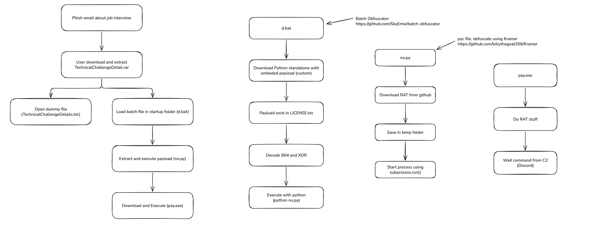

# Ocean and Engines

Challenge author: n3r

This challenge consist of 4 flags to capture.

Challenge Link: [https://drive.google.com/file/d/1O6Uftr3V8WcRQsUpOZlzRQ1z1705qOsn/view?usp=sharing](https://drive.google.com/file/d/1O6Uftr3V8WcRQsUpOZlzRQ1z1705qOsn/view?usp=sharing)

# Attack Flow

# Oceans & Engines 1
Description: Ahmad, a fresh graduate sofware developer student, was trying to land his first job. However, things took a turn when he accidently downloaded a malicious attachment. Found out what did Ahmad download.
Solution:
- Look at Outlook email inbox
- or emails under Documents folder
- From all the inboxes, there's only one email containing an attachment
- Retrieve the attachment
- Extract it, will find a dummy file that have a flag
- I think the flag is a giveaway for the next chal haha
Flag: `GCTF25{winrawr-cve-kinda-c00l}`

# Oceans & Engines 2
Description: Find the next stage.
- To find the next payload, analyse the .rar
- rar.exe lta filename.rar
- This command will display where the payload being dropped.
- Supposedly in startup folder
- The batch file is obfuscated with string substitution and escape character techniques.
- If participant not familiar with this, i think it's a hard time for them
- Flag is in variable declaration
Flag: `GCTF25{is-this-impossible-tricky-or-skill-issue}`

# Oceans & Engines 3
Description: Find the next stage.
- From the previous batch file, we can see it downloads a Python Standalone from github
- The archive have been modified
- Find the payload in LICENSE.txt
- Decode it using XOR and base64
- The next payload is an obfuscated pyc file
- The pyc file being obfuscated using kramer
- Need to lookup how to deobfuscated kramer
- Flag is in variable declaration
Flag: `GCTF25{kramer-krame-kram-kra-kr-k}`

# Oceans & Engines 4
Description: Nice! Then what?
- After deobfuscate the previous pyc file, we can see it downloads another file from github
- It is a python exe
- Decompile it and find the discord token
- Participant need to find a way to get into the C2
- The C2 consist of a few channel displaying remote access from victim
- Flag is in "general" channel
Flag: `GCTF25{inevitable-discord-c2}`
