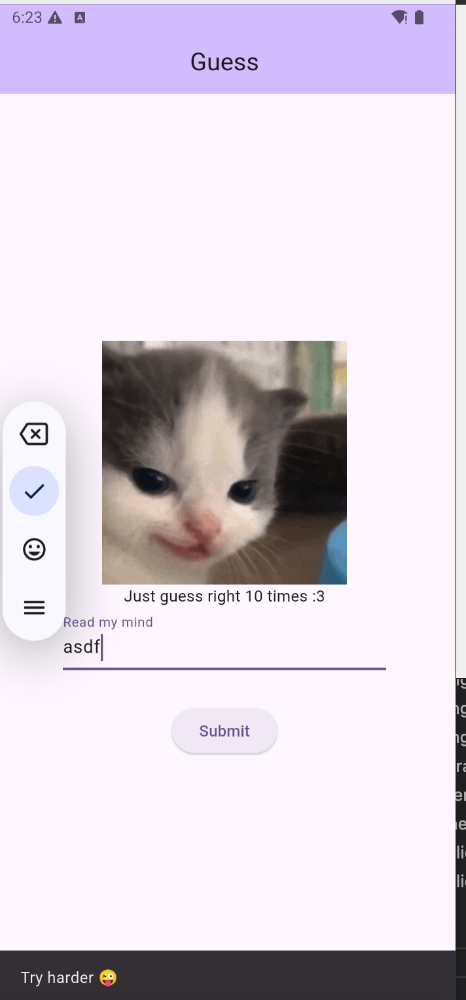
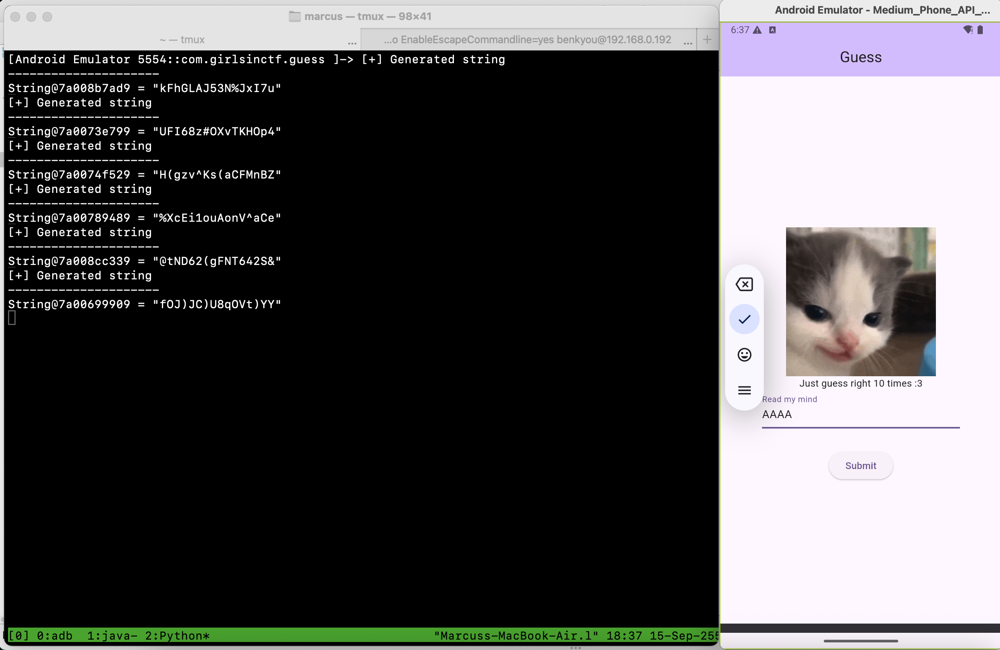
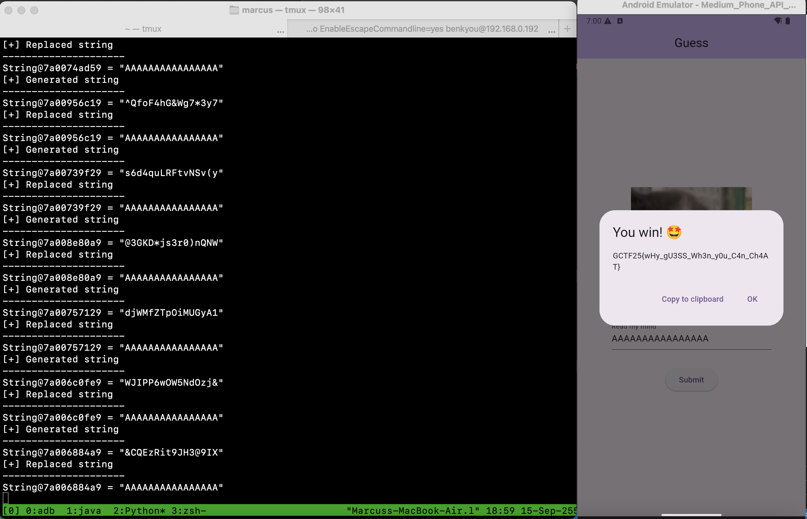

# Guess

Challenge Author: benkyou

The goal of this challenge is to teach players how to hook native methods in Flutter and do code tampering with Frida.
They can also solve this challenge by patching the native libapp.so library. This method is a lot more difficult imo because you'll have to write some IDA scripts to parse the library. (Ref: https://www.guardsquare.com/blog/obstacles-in-dart-decompilation-and-the-impact-on-flutter-app-security)


The win condition here is to make 10 correct guesses in a row.
But no matter what you input, it fails, and we don't even know what exactly are we supposed to be guessing?!



The app is implemented in Flutter and we can use [blutter](https://github.com/worawit/blutter) to decompile it for static analysis.

```
docker run --rm -it -v "${PWD}:/tmp" blutter  guess.apk out
```

After running blutter, the assembly can be found in `asm/guess/*.dart`.

We can first go through the function symbols to find points of interests.
One such method is `_makeGuess` in `asm/guess/main.dart`.
The `ElevatedButton`'s `onPressed` makes a callback to `_makeGuess`, which we can make an educated guess compares the user's input against the expected value.
This expected value is retrieved from `generateMagicString()`

```
  _ _makeGuess(/* No info */) {
...function prologue...
    // 0x2cb9ec: r0 = generateMagicString()
    //     0x2cb9ec: bl              #0x2dbc68  ; [package:guess/utils.dart] ::generateMagicString
```

`generateMagicString()` is implemented in `asm/guess/utils.dart` and its offset is at 0x2dbc68.
At this point, you make a hypothesis that `generateMagicString()` is responsible for returning the string that we're supposed to guess.
To confirm our hypothesis, we can hook the return values of this method using `frida`.

```
  static _ generateMagicString(/* No info */) {
    // ** addr: 0x2dbc68, size: 0x414
```

> You may have also discovered the `getFlag()` method in `asm/guess/utils.dart` which is responsible for retrieving the flag. But the assembly for this method is very complex so it will take us a lot of effort and time to reverse engineer how it actually works.

To hook `generateMagicString()`, we can use the frida script generated from blutter with some slight modification to `onLibappLoaded()` to log the return values.

```
function onLibappLoaded() {
    // from decompiled asm/guess/utils.dart
    //   static _ generateMagicString(/* No info */) {
    // ** addr: 0x2dbc68, size: 0x414
    const fn_addr = 0x2dbc68;
    Interceptor.attach(libapp.add(fn_addr), {
        onLeave (ret) {
            init(this.context);
            var [tptr, cls, values] = getTaggedObjectValue(ret);
            console.log(`[+] Generated string`);
            console.log(`---------------------`);
            console.log(`${cls.name}@${tptr.toString().slice(2)} =`, JSON.stringify(values, null, 2));
        }
    });
}
```



Great, now we know that `generateMagicString()` returns a random fixed length string of 16.
To beat the challenge, what we can do is modify the return values of `generateMagicString()` to something that we control so that we get the correct guess each time.

We will have to modify the frida script from blutter to allow us to overwrite values.

> If you're familiar with frida, you might be wondering why we can't just do `writeUtf8String` to overwrite the strings. This is because we are dealing with Dart string objects.

Working off of the code in `onLibappLoaded()` we should try to understand how the values are read from the objects.

Our values are being retrieved using `getObjectValue(ptr, cls, depthLeft)`. Also note that `ptr = ptr.sub(1)` because we account for the Dart object tag.

For reference, each Dart object starts with a 4 byte tag containing its class ID `cid`.

```c
struct DartObjectTag
{
 char is_canonical_and_gc;
 char size_tag;
 __int16 cid;
};
```

```javascript
// tptr (tagged pointer) is only for tagged object (HeapBit in address except Smi)
// return format: [tptr, cls, values]
function getTaggedObjectValue(tptr, depthLeft = MaxDepth) {
    if (!isHeapObject(tptr)) {
        // smi
        // TODO: below support only compressed pointer (4 bytes)
        return [tptr, Classes[CidSmi], tptr.toInt32() >> 1];
    }

    tptr = decompressPointer(tptr);
    let ptr = tptr.sub(1);
    const cls = Classes[getObjectCid(ptr)];
    const values = getObjectValue(ptr, cls, depthLeft);
    return [tptr, cls, values];
}
```

`getObjectValue` uses the `cid` in a switch case to handle different object types. We're interested in the case for `CidString` because we're dealing with Dart strings here.

```javascript
function getObjectValue(ptr, cls, depthLeft = MaxDepth) {
    switch (cls.id) {
    case CidObject:
        console.error(`Object cid should not reach here`);
        return;
    case CidNull:
        return null;
    case CidBool:
        return getDartBool(ptr, cls);
    case CidString:
        return getDartString(ptr, cls);
```

Here's the code that reads the string from the pointer using `readUtf8String`. 
So what we need to do is modify the code here to do a `writeUtf8String` instead.

```js
function getDartString(ptr, cls) {
    const len = ptr.add(cls.lenOffset).readU32() >> 1; // Dart store string length as Smi
    return ptr.add(cls.dataOffset).readUtf8String(len);
}
```

Here's the new method that we implement. Note that the value that we write back to `generateMagicString()`'s return value must be the same length otherwise our app will crash.

```js
function exploit(ptr, cls) {
    // We know that the generateMagicString always returns at 16 character string from hooking return value.
    // Replace with payload of the same length.
    var payload = "A".repeat(16);
    ptr.add(cls.dataOffset).writeUtf8String(payload);
}
```

Then, we call this method in our hooked method's `onLeave` to overwrite the return values.

```js
function onLibappLoaded() {
    // from decompiled asm/guess/utils.dart
    //   static _ generateMagicString(/* No info */) {
    // ** addr: 0x2dbc68, size: 0x414
    const fn_addr = 0x2dbc68;
    Interceptor.attach(libapp.add(fn_addr), {
        onLeave (ret) {
            init(this.context);
            var [tptr, cls, values] = getTaggedObjectValue(ret);
            console.log(`[+] Generated string`);
            console.log(`---------------------`);
            console.log(`${cls.name}@${tptr.toString().slice(2)} =`, JSON.stringify(values, null, 2));
            // Replace ret with our own Dart string
            console.log(`[+] Replaced string`);
            console.log(`---------------------`);
            var ptr = tptr.sub(1);
            exploit(ptr, cls);
            var [tptr, cls, values] = getTaggedObjectValue(ret);
            console.log(`${cls.name}@${tptr.toString().slice(2)} =`, JSON.stringify(values, null, 2));
        }
    });
}
```

Finally, run the frida script and input the string AAAAAAAAAAAAAAAA 10 times in a row to get the flag.

```
frida -U -f com.girlsinctf.guess -l blutter_frida.js
```



Flag: `GCTF25{wHy_gU3SS_Wh3n_y0u_C4n_Ch4AT}`