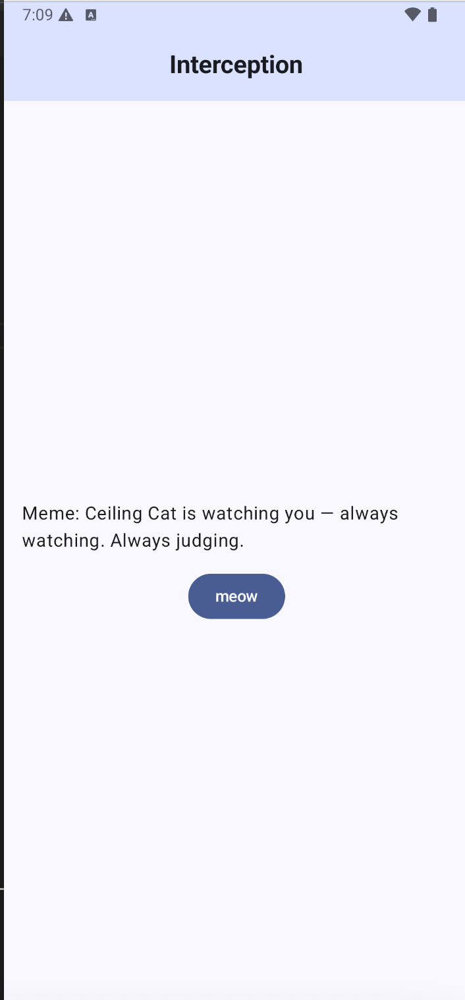
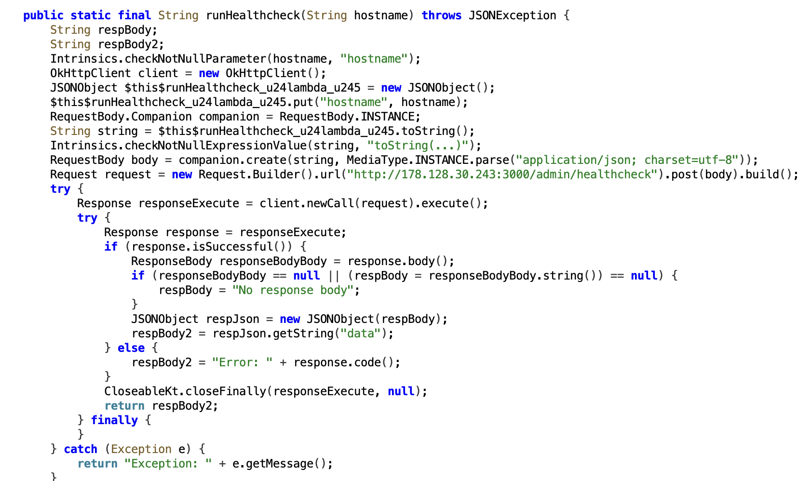
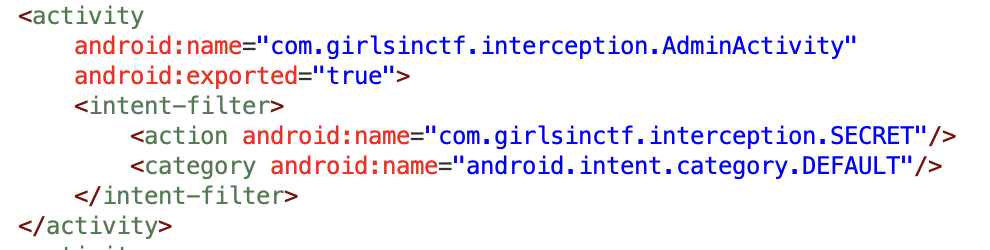
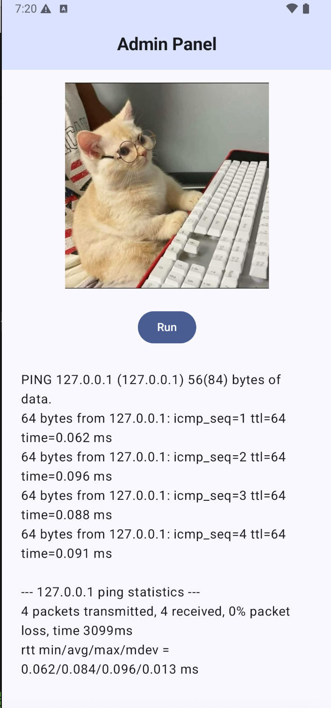
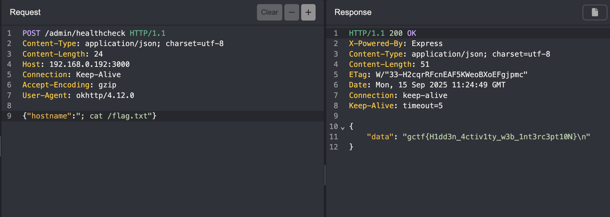

# Interception

Challenge Author: benkyou

To solve this challenge, the player will need to know:
1. How activities and intents work
2. Intercepting network traffic
3. Basic web exploitation

The app fetches random cat facts for you, and that's about it.




## Solution 1 

To solve this challenge, you can decompile the APK with `jadx` and discover the healthcheck endpoint in `AdminActivityKt`



You can craft your own HTTP request and exploit a command injection vulnerability on the server to read the flag.

## Solution 2 (intended)

In the app's manifest file, there is an additional activity that is not interactable from the app's main UI.



The `AdminActivity` activity has a `SECRET` intent.
If we analyse the code for `AdminActivityKt`, we'll learn that `AdminActivity` uses this intent for access control and it expects the ADMIN_KEY string extra to be the value from admin_key in `strings.xml`.
The idea here being that the developer has introduced a feature in the app for administrators to monitor their servers, and decided to hide it from the app's main UI.

```kotlin
...
final String adminKey = getIntent().getStringExtra("ADMIN_KEY");
...
// it's comparing the intent string with admin_key in string.xml
    if (Intrinsics.areEqual(str, adminActivity.getString(R.string.admin_key))) {
```

```
<?xml version="1.0" encoding="utf-8"?>
<resources>
    <string name="admin_key">CHANGE_THIS_IN_PRODUCTION</string>
```

To access `AdminActivity`:

```
adb shell am start -n com.girlsinctf.interception/.AdminActivity -a com.girlsinctf.interception.SECRET --es ADMIN_KEY CHANGE_THIS_IN_PRODUCTION
```

The admin panel is for doing healthchecks against the *very important* server for storing cat facts.
From the output, it's the output from the `ping` command against 127.0.0.1


We can intercept the request made when pressing on the button, then exploit the command injection vulnerability to read the flag at `/flag.txt`.



Flag: `GCTF25{H1dd3n_4ctiv1ty_w3b_1nt3rc3pt10N}`