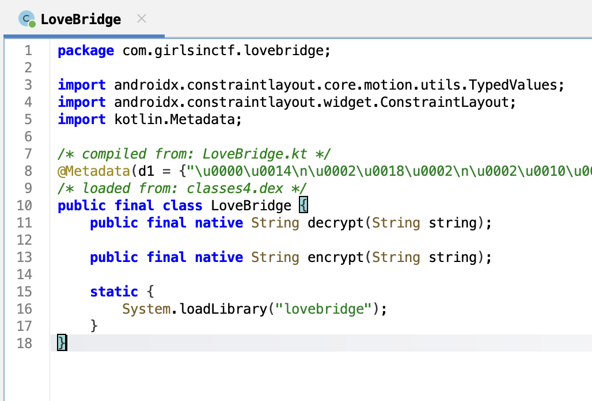
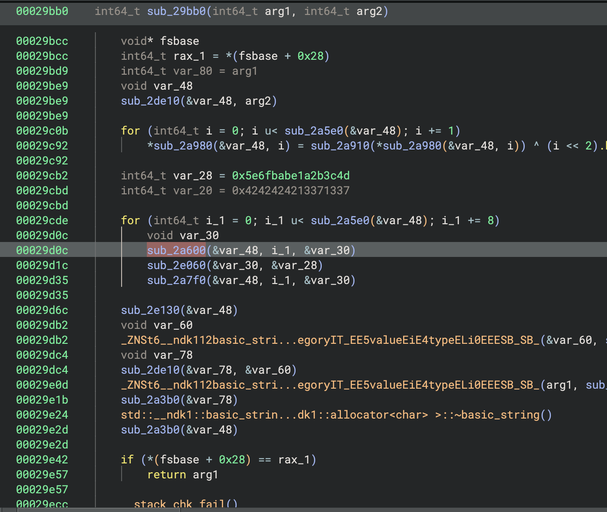
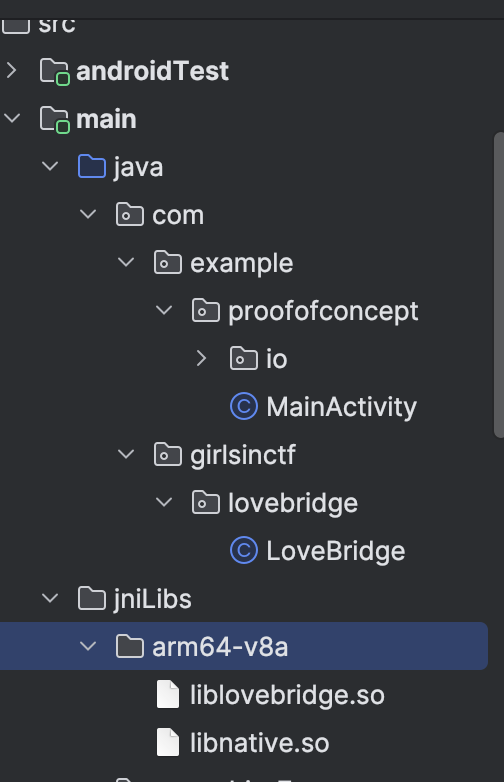
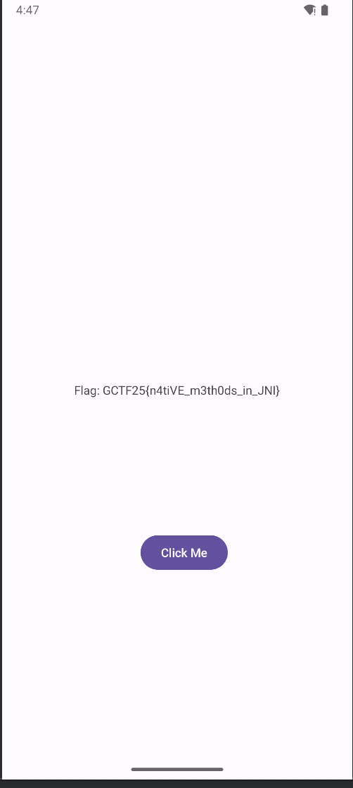
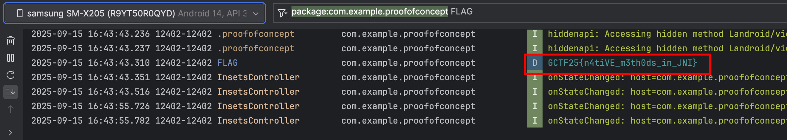

# Love Bridge

Challenge Author: benkyou

Players are given this in the challenge description.
They will have to figure out how to decrypt this string to get the flag.

```
APLZrJpUBOnEW1aGVmHk7WpGjV/ZaYuvJsyyw4powxmWbbxK+Q03Bg==
```

The goal of this challenge is to teach players how native C++ code can be used in Java/Kotlin using the [JNI interface](https://developer.android.com/training/articles/perf-jni).

When you decompile the APK using `jadx`, there's nothing much going on in MainActivity, but you'll find the LoveBridge class which implements the `decrypt` and `encrypt` native methods.

These methods make JNI calls to `liblovebridge.so` which is implemented in C++.



You may extract the native library using `apktool` and try to reverse it using a disassembler but you'll find that it's quite difficult to do because the logic is all over the place (frankly I don't even know how the cryptography here works :D).



## Solution

Instead, we create a PoC app that imports the native library, and calls the `decrypt()` function with the challenge input string.

First decompile the APK using `apktool` to get the native library under `lovebridge/lib/<TARGET_ARCH>/liblovebridge.so`

```
apktool d lovebridge.apk
```

In your Android Studio project, place the native library file in `jniLibs` in your source code directory (create if doesn't exists yet). Example: `/app/src/main/jniLibs/arm64-v8a`



Implement the LoveBridge class from decompiled APK.
Here, we also implement a `solve()` method that will return the results of `decrypt` to give us the flag string.

```java
package com.girlsinctf.lovebridge;
public class LoveBridge {

    public static native String decrypt(String string);

    public static String solve() {
        System.loadLibrary("lovebridge");
        return decrypt("APLZrJpUBOnEW1aGVmHk7WpGjV/ZaYuvJsyyw4powxmWbbxK+Q03Bg==");
    }
}
```

Call `LoveBridge.solve()` in MainActivity:

```java
package com.example.proofofconcept;

import android.os.Bundle;
import android.widget.TextView;

import androidx.activity.EdgeToEdge;
import androidx.appcompat.app.AppCompatActivity;
import androidx.core.graphics.Insets;
import androidx.core.view.ViewCompat;
import androidx.core.view.WindowInsetsCompat;

import com.girlsinctf.lovebridge.LoveBridge;

public class MainActivity extends AppCompatActivity {

    @Override
    protected void onCreate(Bundle savedInstanceState) {
        super.onCreate(savedInstanceState);
        EdgeToEdge.enable(this);
        setContentView(R.layout.activity_main);
        TextView homeText = findViewById(R.id.home_text);
        String flag = LoveBridge.solve();
        Log.d("FLAG", flag);
        homeText.setText("Flag: " + flag);
        ViewCompat.setOnApplyWindowInsetsListener(findViewById(R.id.main), (v, insets) -> {
            Insets systemBars = insets.getInsets(WindowInsetsCompat.Type.systemBars());
            v.setPadding(systemBars.left, systemBars.top, systemBars.right, systemBars.bottom);
            return insets;
        });
    }
}
```





Flag: `GCTF25{n4tiVE_m3th0ds_in_JNI}`