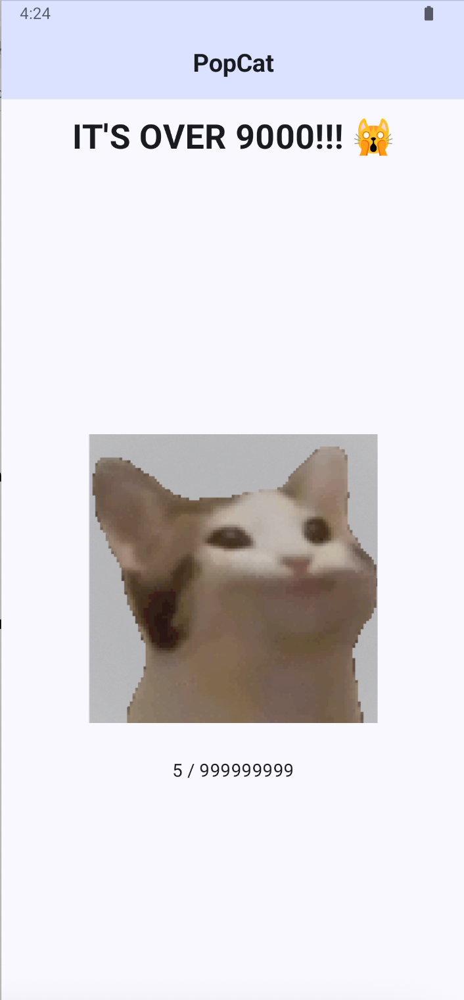

# Popcat

Challenge Author: benkyou

The win condition for this challenge is to click the cat 999999999 times.
This isn't possible, so this challenge teaches basic APK static analysis using `jadx` to get around the win condition.



There are many ways to solve this.
- Reverse decryption logic (easiest)
- Patch the application logic
- Frida hook

## Solution 1 (reverse)

Decompile apk using `jadx-gui`.

The win condition is in this block in `com.girlsinctf.popcat.MainActivityKt`

```
MutableState winDialog$delegate = (MutableState) value$iv;
$composer.endReplaceGroup();
if (MainActivityKt.PopcatApp$lambda$4(this.$clickCount$delegate) < 999999999) {
    z = true;
} else {
    z = true;
    invoke$lambda$2(winDialog$delegate, true);
}
...
final String flag = FlagProvider.INSTANCE.getFlag(this.$context);
```

You can then trace the flag decryption logic to the `getFlag()` method in `com.girlsinctf.popcat.FlagProvider`.

```python
    public final String getFlag(Context context) {
        Intrinsics.checkNotNullParameter(context, "context");
        String f1 = context.getString(R.string.f1);
        Intrinsics.checkNotNullExpressionValue(f1, "getString(...)");
        String f2 = context.getString(R.string.f2);
        Intrinsics.checkNotNullExpressionValue(f2, "getString(...)");
        byte[] k1 = "meowmeowmeowmeow".getBytes(Charsets.UTF_8);
        Intrinsics.checkNotNullExpressionValue(k1, "getBytes(...)");
        byte[] k2 = "meowmeowmeowmeowmeow".getBytes(Charsets.UTF_8);
        Intrinsics.checkNotNullExpressionValue(k2, "getBytes(...)");
        byte[] c1 = Base64.decode(f1, 0);
        byte[] c2 = Base64.decode(f2, 0);
        int length = c1.length;
        byte[] bArr = new byte[length];
        for (int i = 0; i < length; i++) {
            bArr[i] = (byte) (c1[i] ^ k1[i % k1.length]);
        }
        byte[] h1 = ArraysKt.reversedArray(bArr);
        int length2 = c2.length;
        byte[] bArr2 = new byte[length2];
        for (int i2 = 0; i2 < length2; i2++) {
            bArr2[i2] = (byte) (c2[i2] ^ k2[i2 % k2.length]);
        }
        byte[] h2 = ArraysKt.reversedArray(bArr2);
        return new String(ArraysKt.plus(h1, h2), Charsets.UTF_8);
    }
```

Here's what `getFlag()` is doing:
1. It fetches the strings f1 and f2 from `strings.xml`.
2. c1 and c2 are the base64 decoded values of f1 and f2.
3. c1 is XORed with k1 `meowmeowmeowmeow` and c2 is XORed with k2 `meowmeowmeowmeowmeow`
4. The XORed values are reversed then concatenated.

Python script to get the flag.

```python
import base64

# Get f1 and f2 from strings.xml
f1 = "MlUbKF4IXxQBVhgMWFcpIy4i"
f2 = "EEROVkwiAUYGBls/MgEGQz8BAUM=="

k1 = "meowmeowmeowmeow".encode()
k2 = "meowmeowmeowmeowmeow".encode()

c1 = base64.b64decode(f1)
c2 = base64.b64decode(f2)

# XOR ciphertext with key
h1 = bytes([d ^ k1[i % len(k1)] for i,d in enumerate(c1)])
h2 = bytes([d ^ k2[i % len(k2)] for i,d in enumerate(c2)])

# Reverse h1 and h2, then join them to get the flag
print((h1[::-1]+h2[::-1]).decode())
```

## Solution 2 (Frida hooking)

When we click on the cat, it increments a counter.
Through static analysis you will learn that this is being tracked using this mutable.

```
final MutableState<Integer> mutableState2 = this.$clickCount$delegate;
```

Trace usage for `$clickCount$delegate` and you'll land on `MainActivityKt.PopcatApp$lambda$5` which is used to update the mutable's value.

```java
public static final void PopcatApp$lambda$5(MutableState<Integer> mutableState, int i) {
    mutableState.setValue(Integer.valueOf(i));
}
```

We want to hook this method when we click on the cat, then overwrite the value of `int i` so that we get 999999999 and get the flag.

Frida script:

```javascript
Java.perform(() => {
    var MainActivity = Java.use('com.girlsinctf.popcat.MainActivityKt');
    MainActivity.PopcatApp$lambda$5
        .overload('androidx.compose.runtime.MutableState', 'int')
        .implementation = function(state, i) {
            console.log(`[+] State: ${state}`)
            console.log(`[+] i: ${i}`)
            // Modify our score to get flag
            this.PopcatApp$lambda$5(state, 999999999);
        }
})
```

Run the frida script and click on the cat to win:

```
frida -U -f com.girlsinctf.popcat -l popcat.js
```


Flag: `GCTF25{w3lc0m3_t0_4ndR4id_H4ck1nG!!!!}