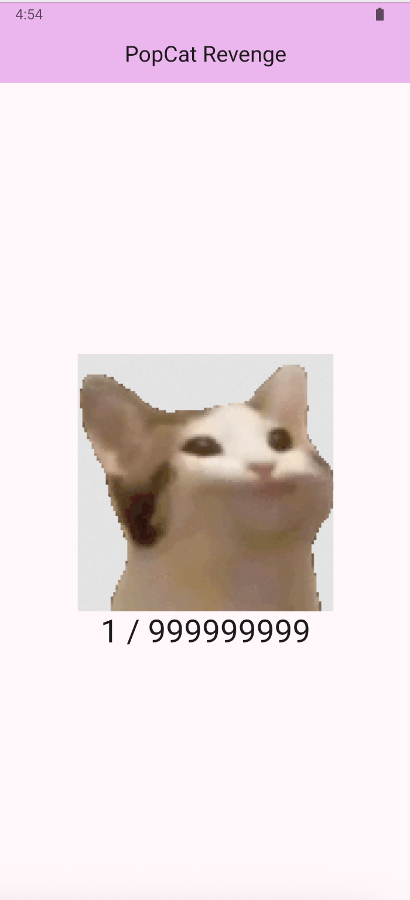
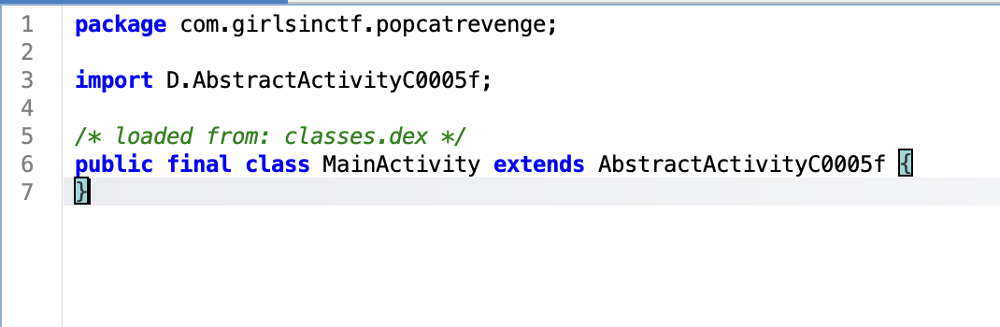
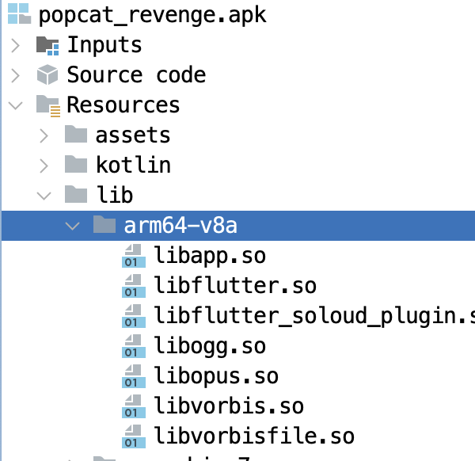

# Popcat Revenge

Challenge Author: benkyou

This is a more difficult version of Popcat.
The application logic is identical in both apps, the only difference being that Popcat Revenge is written in Flutter instead of Kotlin, which makes reverse engineering a bit more harder.

The goal here is to introduce players to basic Flutter reverse engineering.
The challenge can be solved through static analysis or hooking. Either method forces the player to read some assembly to understand the application logic.

The win condition is the same as Popcat, we need to click the cat 999999999 times to get the flag.



When you decompile the APK in `jadx`, you'll notice that nothing much is going on. For example, the MainActivity is *empty*.
This is because the application was written using Flutter, and the Dart code compiles to native code that is executed by the Dart VM.



You can confirm this through the `libflutter.so` and `libapp.so` libraries under `/lib` or searching for `System.loadLibrary` calls that import them.



The application code is in `libapp.so`, and you may analyse this using a disassembler of your choice (but there're some extra steps that you need to prepare your disassembler to handle Dart code. You may refer to [this blog series](https://www.guardsquare.com/blog/obstacles-in-dart-decompilation-and-the-impact-on-flutter-app-security) for further info.)

## Solution

We can use [blutter](https://github.com/worawit/blutter) to decompile the Flutter app. I suggest running blutter inside of a container to avoid dependency issues.

```
docker run --rm -it -v "${PWD}:/tmp" blutter popcat_revenge.apk out
```

After blutter finishes running, the assembly for the app can be found in `asm/popcat_revenge/main.dart`.

Player needs to read the assembly in `getFlag()`

Blutter is able to parse function symbols from the Dart code, and one of the methods of interest to us is `getFlag()`.

```
  static String getFlag() {
    // ** addr: 0x2485d8, size: 0x1d0
    // 0x2485d8: EnterFrame
    //     0x2485d8: stp             fp, lr, [SP, #-0x10]!
    //     0x2485dc: mov             fp, SP
    // 0x2485e0: AllocStack(0x28)
    //     0x2485e0: sub             SP, SP, #0x28
    // 0x2485e4: CheckStackOverflow
    //     0x2485e4: ldr             x16, [THR, #0x38]  ; THR::stack_limit
    //     0x2485e8: cmp             SP, x16
    //     0x2485ec: b.ls            #0x248798
    // 0x2485f0: r1 = <int>
    //     0x2485f0: ldr             x1, [PP, #0xcd8]  ; [pp+0xcd8] TypeArguments: <int>
    // 0x2485f4: r2 = 70
    //     0x2485f4: movz            x2, #0x46
    // 0x2485f8: r0 = AllocateArray()
    //     0x2485f8: bl              #0x332c98  ; AllocateArrayStub
    // 0x2485fc: stur            x0, [fp, #-0x18]
    // 0x248600: r16 = 10
    //     0x248600: movz            x16, #0xa
    // 0x248604: StoreField: r0->field_f = r16
    //     0x248604: stur            w16, [x0, #0xf]
    // 0x248608: r16 = 2
    //     0x248608: movz            x16, #0x2
    // 0x24860c: StoreField: r0->field_13 = r16
    //     0x24860c: stur            w16, [x0, #0x13]
    // 0x248610: r16 = 44
    //     0x248610: movz            x16, #0x2c
    // 0x248614: ArrayStore: r0[0] = r16  ; List_4
    //     0x248614: stur            w16, [x0, #0x17]
    // 0x248618: r16 = 8
    //     0x248618: movz            x16, #0x8
    // 0x24861c: StoreField: r0->field_1b = r16
    //     0x24861c: stur            w16, [x0, #0x1b]
    // 0x248620: r16 = 224
    //     0x248620: movz            x16, #0xe0
    // 0x248624: StoreField: r0->field_1f = r16
    //     0x248624: stur            w16, [x0, #0x1f]
    // 0x248628: r16 = 238
    //     0x248628: movz            x16, #0xee
    // 0x24862c: StoreField: r0->field_23 = r16
    //     0x24862c: stur            w16, [x0, #0x23]
    // 0x248630: r16 = 114
    //     0x248630: movz            x16, #0x72
    // 0x248634: StoreField: r0->field_27 = r16
    //     0x248634: stur            w16, [x0, #0x27]
    // 0x248638: r16 = 72
    //     0x248638: movz            x16, #0x48
    // 0x24863c: StoreField: r0->field_2b = r16
    //     0x24863c: stur            w16, [x0, #0x2b]
    // 0x248640: r16 = 92
    //     0x248640: movz            x16, #0x5c
    // 0x248644: StoreField: r0->field_2f = r16
    //     0x248644: stur            w16, [x0, #0x2f]
    // 0x248648: r16 = 110
    //     0x248648: movz            x16, #0x6e
    // 0x24864c: StoreField: r0->field_33 = r16
    //     0x24864c: stur            w16, [x0, #0x33]
    // 0x248650: r16 = 44
    //     0x248650: movz            x16, #0x2c
    // 0x248654: StoreField: r0->field_37 = r16
    //     0x248654: stur            w16, [x0, #0x37]
    // 0x248658: r16 = 44
    //     0x248658: movz            x16, #0x2c
    // 0x24865c: StoreField: r0->field_3b = r16
    //     0x24865c: stur            w16, [x0, #0x3b]
    // 0x248660: r16 = 226
    //     0x248660: movz            x16, #0xe2
    // 0x248664: StoreField: r0->field_3f = r16
    //     0x248664: stur            w16, [x0, #0x3f]
    // 0x248668: r16 = 96
    //     0x248668: movz            x16, #0x60
    // 0x24866c: StoreField: r0->field_43 = r16
    //     0x24866c: stur            w16, [x0, #0x43]
    // 0x248670: r16 = 58
    //     0x248670: movz            x16, #0x3a
    // 0x248674: StoreField: r0->field_47 = r16
    //     0x248674: stur            w16, [x0, #0x47]
    // 0x248678: r16 = 94
    //     0x248678: movz            x16, #0x5e
    // 0x24867c: StoreField: r0->field_4b = r16
    //     0x24867c: stur            w16, [x0, #0x4b]
    // 0x248680: r16 = 236
    //     0x248680: movz            x16, #0xec
    // 0x248684: StoreField: r0->field_4f = r16
    //     0x248684: stur            w16, [x0, #0x4f]
    // 0x248688: r16 = 82
    //     0x248688: movz            x16, #0x52
    // 0x24868c: StoreField: r0->field_53 = r16
    //     0x24868c: stur            w16, [x0, #0x53]
    // 0x248690: r16 = 226
    //     0x248690: movz            x16, #0xe2
    // 0x248694: StoreField: r0->field_57 = r16
    //     0x248694: stur            w16, [x0, #0x57]
    // 0x248698: r16 = 238
    //     0x248698: movz            x16, #0xee
    // 0x24869c: StoreField: r0->field_5b = r16
    //     0x24869c: stur            w16, [x0, #0x5b]
    // 0x2486a0: r16 = 58
    //     0x2486a0: movz            x16, #0x3a
    // 0x2486a4: StoreField: r0->field_5f = r16
    //     0x2486a4: stur            w16, [x0, #0x5f]
    // 0x2486a8: r16 = 44
    //     0x2486a8: movz            x16, #0x2c
    // 0x2486ac: StoreField: r0->field_63 = r16
    //     0x2486ac: stur            w16, [x0, #0x63]
    // 0x2486b0: r16 = 84
    //     0x2486b0: movz            x16, #0x54
    // 0x2486b4: StoreField: r0->field_67 = r16
    //     0x2486b4: stur            w16, [x0, #0x67]
    // 0x2486b8: r16 = 230
    //     0x2486b8: movz            x16, #0xe6
    // 0x2486bc: StoreField: r0->field_6b = r16
    //     0x2486bc: stur            w16, [x0, #0x6b]
    // 0x2486c0: r16 = 88
    //     0x2486c0: movz            x16, #0x58
    // 0x2486c4: StoreField: r0->field_6f = r16
    //     0x2486c4: stur            w16, [x0, #0x6f]
    // 0x2486c8: r16 = 10
    //     0x2486c8: movz            x16, #0xa
    // 0x2486cc: StoreField: r0->field_73 = r16
    //     0x2486cc: stur            w16, [x0, #0x73]
    // 0x2486d0: r16 = 98
    //     0x2486d0: movz            x16, #0x62
    // 0x2486d4: StoreField: r0->field_77 = r16
    //     0x2486d4: stur            w16, [x0, #0x77]
    // 0x2486d8: r16 = 58
    //     0x2486d8: movz            x16, #0x3a
    // 0x2486dc: StoreField: r0->field_7b = r16
    //     0x2486dc: stur            w16, [x0, #0x7b]
    // 0x2486e0: r16 = 84
    //     0x2486e0: movz            x16, #0x54
    // 0x2486e4: StoreField: r0->field_7f = r16
    //     0x2486e4: stur            w16, [x0, #0x7f]
    // 0x2486e8: r16 = 236
    //     0x2486e8: movz            x16, #0xec
    // 0x2486ec: StoreField: r0->field_83 = r16
    //     0x2486ec: stur            w16, [x0, #0x83]
    // 0x2486f0: r16 = 96
    //     0x2486f0: movz            x16, #0x60
    // 0x2486f4: StoreField: r0->field_87 = r16
    //     0x2486f4: stur            w16, [x0, #0x87]
    // 0x2486f8: r16 = 76
    //     0x2486f8: movz            x16, #0x4c
    // 0x2486fc: StoreField: r0->field_8b = r16
    //     0x2486fc: stur            w16, [x0, #0x8b]
    // 0x248700: r16 = 226
    //     0x248700: movz            x16, #0xe2
    // 0x248704: StoreField: r0->field_8f = r16
    //     0x248704: stur            w16, [x0, #0x8f]
    // 0x248708: r16 = 96
    //     0x248708: movz            x16, #0x60
    // 0x24870c: StoreField: r0->field_93 = r16
    //     0x24870c: stur            w16, [x0, #0x93]
    // 0x248710: r16 = 126
    //     0x248710: movz            x16, #0x7e
    // 0x248714: StoreField: r0->field_97 = r16
    //     0x248714: stur            w16, [x0, #0x97]
    // 0x248718: r4 = ""
    //     0x248718: ldr             x4, [PP, #0x498]  ; [pp+0x498] ""
    // 0x24871c: r3 = 0
    //     0x24871c: movz            x3, #0
    // 0x248720: stur            x4, [fp, #-8]
    // 0x248724: stur            x3, [fp, #-0x10]
    // 0x248728: CheckStackOverflow
    //     0x248728: ldr             x16, [THR, #0x38]  ; THR::stack_limit
    //     0x24872c: cmp             SP, x16
    //     0x248730: b.ls            #0x2487a0
    // 0x248734: cmp             x3, #0x23
    // 0x248738: b.ge            #0x248788
    // 0x24873c: ArrayLoad: r1 = r0[r3]  ; Unknown_4
    //     0x24873c: add             x16, x0, x3, lsl #2
    //     0x248740: ldur            w1, [x16, #0xf]
    // 0x248744: DecompressPointer r1
    //     0x248744: add             x1, x1, HEAP, lsl #32
    // 0x248748: r2 = LoadInt32Instr(r1)
    //     0x248748: sbfx            x2, x1, #1, #0x1f
    //     0x24874c: tbz             w1, #0, #0x248754
    //     0x248750: ldur            x2, [x1, #7]
    // 0x248754: r16 = 66
    //     0x248754: movz            x16, #0x42
    // 0x248758: eor             x1, x2, x16
    // 0x24875c: mov             x2, x1
    // 0x248760: r1 = Null
    //     0x248760: mov             x1, NULL
    // 0x248764: r0 = String.fromCharCode()
    //     0x248764: bl              #0x16aca0  ; [dart:core] String::String.fromCharCode
    // 0x248768: ldur            x16, [fp, #-8]
    // 0x24876c: stp             x0, x16, [SP]
    // 0x248770: r0 = +()
    //     0x248770: bl              #0x15ce54  ; [dart:core] _StringBase::+
    // 0x248774: ldur            x1, [fp, #-0x10]
    // 0x248778: add             x3, x1, #1
    // 0x24877c: mov             x4, x0
    // 0x248780: ldur            x0, [fp, #-0x18]
    // 0x248784: b               #0x248720
    // 0x248788: ldur            x0, [fp, #-8]
    // 0x24878c: LeaveFrame
    //     0x24878c: mov             SP, fp
    //     0x248790: ldp             fp, lr, [SP], #0x10
    // 0x248794: ret
    //     0x248794: ret             
    // 0x248798: r0 = StackOverflowSharedWithoutFPURegs()
    //     0x248798: bl              #0x332da0  ; StackOverflowSharedWithoutFPURegsStub
    // 0x24879c: b               #0x2485f0
    // 0x2487a0: r0 = StackOverflowSharedWithoutFPURegs()
    //     0x2487a0: bl              #0x332da0  ; StackOverflowSharedWithoutFPURegsStub
    // 0x2487a4: b               #0x248734
  }
```

There's a lot going on here, but `getFlag()` is basically loading values into an array using `r16` as shown by `StoreField`, before finally doing a single byte XOR of the array with the key 0x42 to give us the flag.

Here's a simplified version.

```
  static String getFlag() {
...function prologue...
    // 0x2485fc: stur            x0, [fp, #-0x18]
    // 0x248600: r16 = 10
    //     0x248600: movz            x16, #0xa
    // 0x248604: StoreField: r0->field_f = r16
...
    // 0x248754: r16 = 66
    //     0x248754: movz            x16, #0x42
    // 0x248758: eor             x1, x2, x16
    // 0x24875c: mov             x2, x1
```

If we extract all the values of the array as is and XOR them with 0x42, we won't actually get the flag.

```python
d = [10,2,44,8,224,238,114,72,92,110,44,44,226,96,58,94,236,82,226,238,58,44,84,230,88,10,98,58,84,236,96,76,226,96,126]
flag = bytes([b ^ 0x42 for b in d])
print(flag.decode('latin-1'))
```

This returns gibberish.

```
H@nJ¢¬0
,nn "x® ¬xn¤H x®" "<
```

This is because integers in Dart are stored differently from conventional integer types.
Dart represents integers using small integers(SMI), medium integers(Mint.), and big integers (BigInt).
An SMI is 31 bits, with the LSB set to 0, and the remaining bits are used to store the value of the integer.
This in effect does a LSL and doubles the value being stored.

Example for storing 'A' which is 0x41:
```
mov r1, 0x41 // wrong in dart
mov r1, 0x82 // correct in dart
```

Therefore, we need to divide each value of the array by 2 before XORing to get the expected values.

```python
d = [10,2,44,8,224,238,114,72,92,110,44,44,226,96,58,94,236,82,226,238,58,44,84,230,88,10,98,58,84,236,96,76,226,96,126]

ct = []
for e in d:
    ct.append(e//2)

flag = bytes([b ^ 0x42 for b in ct])

print(flag.decode('latin-1'))
```

Flag: `GCTF25{fluTT3r_m4k35_Th1nGs_h4rd3r}`